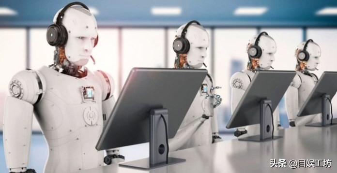
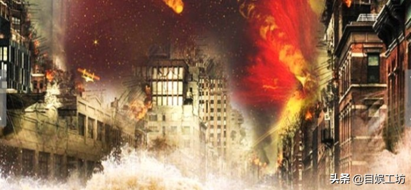

---
# 文章标题
title: "穷人可能突然变得富有，富人可能失去一切"
# 文章副标题
subtitle: "马来西亚先知"
# 文章描述
description: ""
# 发布时间
date: 2022-02-11T18:23:46+08:00
# 最新更新时间
lastmod: 2022-02-11T18:23:46+08:00
# 是否为草稿  true / false
draft: false
# 文章封面图
featuredImage: "1.jpg"
# 标签
tags: ["先知","未来"]
# 类别
categories: [元宇宙]
# 系列
series: []
# 是否不出现在网站首页
hiddenFromHomePage: false
# 是不出现在搜索结果
hiddenFromSearch: false
---

<!--more-->

## **马来西亚先知：穷人可能突然变得富有，富人可能失去一切**

脸书创始人的“虚拟宇宙"计划几乎实现了，人类正在沉浸在虚拟世界中;机器人取代人类，星球之间的战争或许也将爆发...

如果科技一直朝着现在的方向发展，那么不远的将来将进入一个“虚拟世界"的新时代，这就是马来西亚先知达托所说的第九个时代。

先知达托·安东尼·程说：“届时，虚拟技术的扩展将改变一切。虚拟现实（VR）、增强现实（AR）、混合现实（MR）、虚拟视频游戏和感官娱乐技术等将受到欢迎。简单地说，虚拟现实中的风景、物体和人物都是虚构的。然后，人类的意识可以植入另一个空间。

当然，这些老技术也将面临被淘汰的命运。随之，无数新虚拟技术的出现将改变全人类的正常生活。这可能是Facebook创始人想要实现的金属虚拟宇宙。

**1. 虚拟技术登基，旧传统行业被遗忘**
根据八卦，达托说：在第九时期，当火压倒金时，肯定会面临巨大的变化，特别是金代表金融业。这意味着未来的传统金融业将面临巨大的威胁。随着这一方向的发展，电子银行和虚拟货币可能会发展，以适应虚拟技术行业。达托说：“我预测，加密货币和虚拟货币将在未来20年内完全取代现有的物质货币。在这个过程中，穷人可能突然变得富有，富人可以失去一切。世界将迎来许多货币革命"。

经济系统的基础将受到严重破坏。金融游戏的规则和定义也将被改写;新世界将动荡不安。此外，汽车等交通工具也属于金部，因此也将面临“秃顶革命"。

届时，自动驾驶技术将熟练和广泛地应用，取代人为驾驶的车辆。载人汽车只会在落后国家流行。接下来，能源短缺问题日益严重;汽油动力汽车将被淘汰，并完全被纯电动车取代;届时，汽车飞行将是一个主要趋势，未来的世界交通系统将重新定位。当然，在这个转变过程中，世界一定会经历巨大的混乱。

**2. 宇宙和星球之间的战斗**
之后，人类将探索外星空间，具体来说，达托说：“大国的战场也将从地球转移到其他行星上。太空探索将是地缘政治对抗的主要前提。

早在20世纪50年代，美国和苏联之间的冷战就推动了太空竞争。未来，许多国家将争先恐后地探索一个适合人类居住地的行星，这将创造“外太空移民"的目标。

现在，行星研究机构将成为主要战术的投资对象。此外，大国将利用间谍系统入侵和摧毁其他国家的空间方案。

达托说：国际卫星和空间站的数量和战略布局也被列入竞争名单。小国将根据空间技术的力量选择盟友，从而失去自主权。此时许多国家基本上失去了彼此的信任，承诺变成了美丽的谎言。现在，联盟之间随时准备进行战争和对抗。

**3. 机器人取代人类，人类生活在"技术监狱"**
预言家说：“当时人工智能是现代科学技术的一大进步。这是机器的一种智能。人类将原始程序输入机器后。它将经历复杂的程序计算，然后启动认知和学习过程，从而复制和模仿人类的头脑。

这些对未来的预测是非常有根据的，尤其是当许多品牌已经和正在完善他们的AI系统，足以与人类竞争。

“届时，人工智能技术将迅速发展，无需依靠人类。还有一种领先的人工智能超级计算机，可以连接到大数据、区块链、互联网,...同时连接到世界各地的计算机、电子设备和系统，其能力远超人类的极限。

达托补充说：“在未来，人类将不再拥有隐私，所有的东西都用于监控电子设备并引入大数据，它将成为一个重要的全球资产。现在，人类将永远生活在技术监狱中，无法逃脱。

人工智能将取代大多数工作;导致大量失业。在失业的浪潮中，人类将逐渐失去文明的规律。他们将转向虚拟世界进行诈骗，甚至抢劫和侵略。

**4. 思考：当道德跟不上科学发展时，人类或将很快就会被毁灭**
科技发展太快，人类沉迷于物质和人造产品的享受;如果道德标准跟不上，那是灾难，而不是进步。

假设未来的人类可以拥有先进的技术，如先知达托·程预测的那样，没有道德标准来约束;贪婪就会膨胀，为了达到统治地位，善恶都敢做，星球大战就会四处爆发......最后把人类带到了灭亡的边缘。

当道德败坏，技术的发展取代了人类的大脑，人类将被灭亡。

历史上有许多文明的辉煌发展。有一段时间甚至超越了现在的人类;但一夜之间，是毫无痕迹地毁灭。否则因为战争的厮杀，道德低下，业力堆积，势必会遭遇大灾难、瘟疫等。使人类从宇宙中抹去。

达托也提到了这个问题，他说：“在这个时期，人类道德非常扭曲，人命更是微不足道......届时，世界将再次进入颠覆技术革命，文明将被重写。